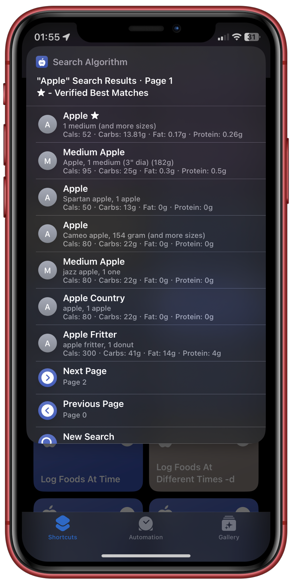

# Nutrition Shortcut
## Basic Information
Log foods from the MyFitnessPal and OpenFoodFacts.org directly to your Apple Health. No applications or accounts required!. Save foods you eat regularly as Presets, access what you've eaten in the past with your Food History. Get statistics with Charty and more!

  
  
  

  
  
  

## Technical Documentation
TODO...