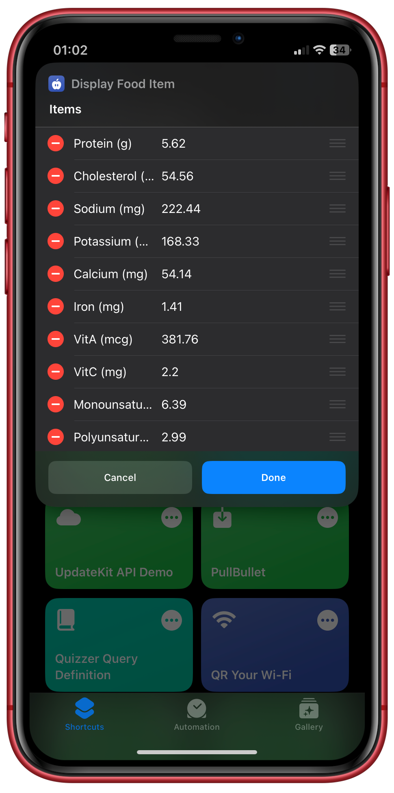
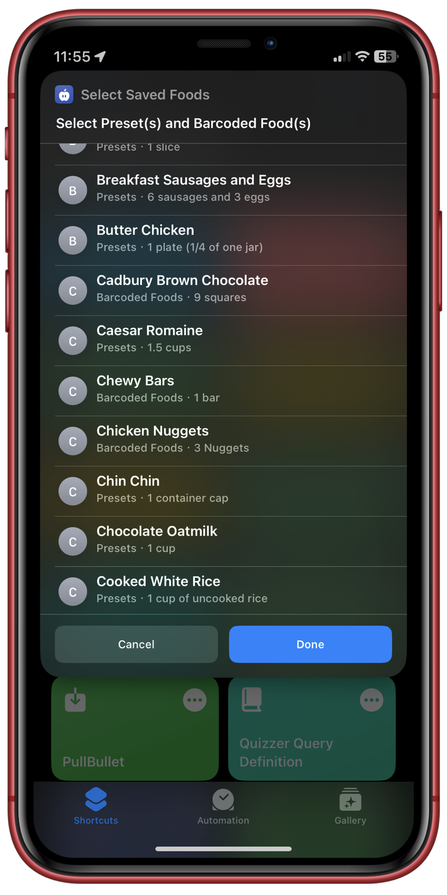
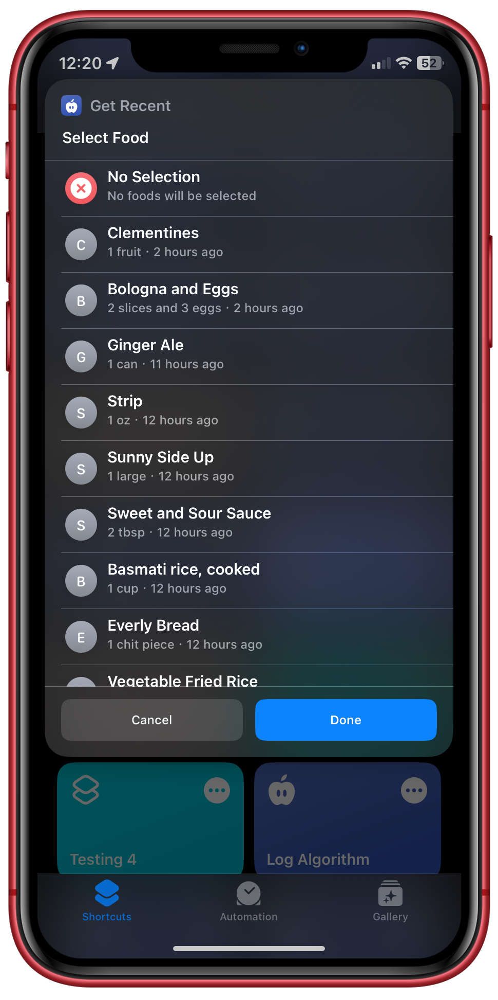
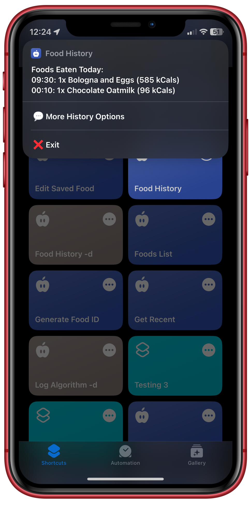
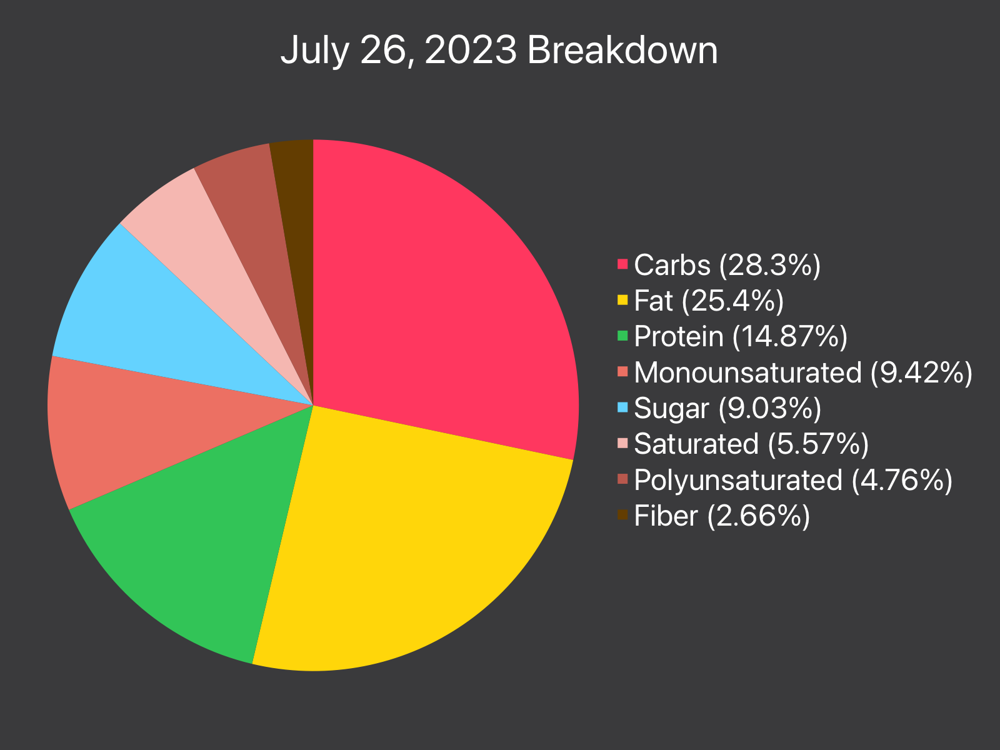
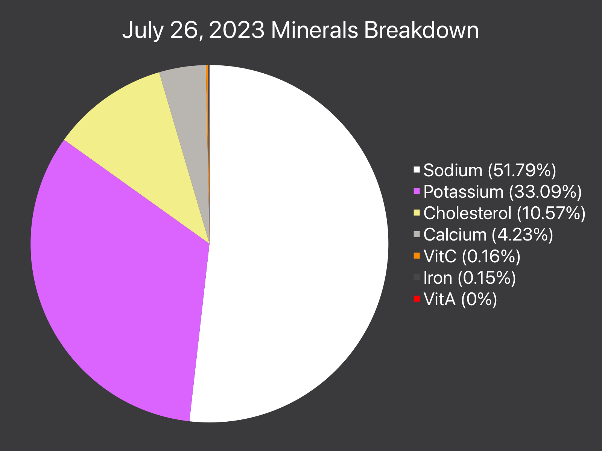
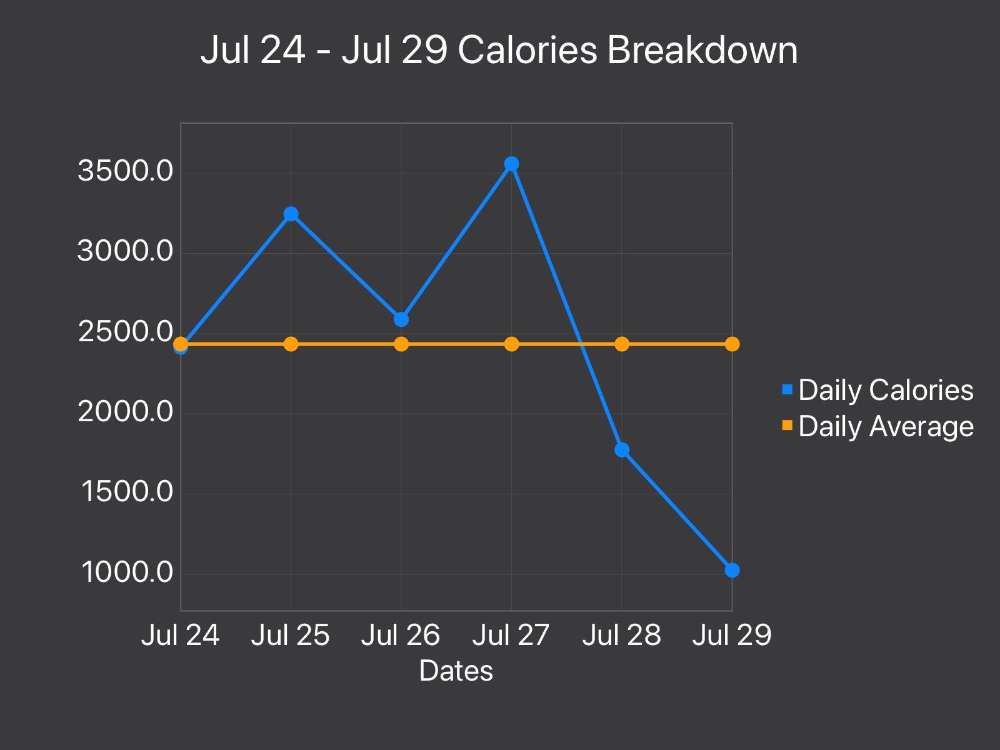

# Nutrition Shortcut
## Basic Information
Log foods from the MyFitnessPal and OpenFoodFacts.org directly to your Apple Health. No applications or accounts required!. Save foods you eat regularly as Presets, access what you've eaten in the past with your Food History. Get statistics with Charty and more!

<p style="align:center;display:flex;justify-content:space-between;flex-wrap:wrap;">
  
  
  
</p>

<p style="align:center;display:flex;justify-content:space-between;flex-wrap:wrap;">
  
  
  
</p>

# Tutorial
View Tutorial [here](https://iffy-pi.github.io/apple-shortcuts/versioning/nutrition/data/tutorial.html).

# Technical Documentation
## Shortcut Links
This documentation will refer to shortcuts by their standard name using bold text e.g. **Log Algorithm**. The table below, maps each of the standard names to their shortcut file on the repo.
 
| Shortcut Name                | Link                                                                           |
| ---------------------------- | ------------------------------------------------------------------------------ |
| Add Recent                   | [Add_Recent.py](./shortcuts/Add_Recent.py)                                     |
| Barcode Search               | [Barcode_Search.py](./shortcuts/Barcode_Search.py)                             |
| Calculate Stats              | [Calculate_Stats.py](./shortcuts/Calculate_Stats.py)                           |
| Clear Cache And Backlog      | [Clear_Cache_And_Backlog.py](./shortcuts/Clear_Cache_And_Backlog.py)           |
| Display Food Item            | [Display_Food_Item.py](./shortcuts/Display_Food_Item.py)                       |
| Edit Saved Food              | [Edit_Saved_Food.py](./shortcuts/Edit_Saved_Food.py)                           |
| Food History                 | [Food_History.py](./shortcuts/Food_History.py)                                 |
| Foods List                   | [Foods_List.py](./shortcuts/Foods_List.py)                                     |
| Generate Food ID             | [Generate_Food_ID.py](./shortcuts/Generate_Food_ID.py)                         |
| Get Recent                   | [Get_Recent.py](./shortcuts/Get_Recent.py)                                     |
| Log Algorithm                | [Log_Algorithm.py](./shortcuts/Log_Algorithm.py)                               |
| Log Foods At Different Times | [Log_Foods_At_Different_Times.py](./shortcuts/Log_Foods_At_Different_Times.py) |
| Log Foods At Time            | [Log_Foods_At_Time.py](./shortcuts/Log_Foods_At_Time.py)                       |
| Make Food Manually           | [Make_Food_Manually.py](./shortcuts/Make_Food_Manually.py)                     |
| Make Preset                  | [Make_Preset.py](./shortcuts/Make_Preset.py)                                   |
| Nutrition                    | [Nutrition.py](./shortcuts/Nutrition.py)                                       |
| Nutrition Statistics         | [Nutrition_Statistics.py](./shortcuts/Nutrition_Statistics.py)                 |
| Saved And Search             | [Saved_And_Search.py](./shortcuts/Saved_And_Search.py)                         |
| Search Algorithm             | [Search_Algorithm.py](./shortcuts/Search_Algorithm.py)                         |
| Select Saved Foods           | [Select_Saved_Foods.py](./shortcuts/Select_Saved_Foods.py)                     |


## Functionality Overview
The main shortcut is **Nutrition**, which provides access to all the provided functionality:
- Quick Log
	- Log one or more recent foods at the current time. Best suited for foods eaten very frequently (see [Quick Log](#quick-log)).
- Log Foods To Apple Health
	- Log a set of foods for a given time with *Log Foods At Time*.
	- Log foods at different times with *Log Foods At Different Times*.
	- See [Logging Foods](#logging-foods).
- Saved Foods
	- Presets to which allow users to save foods they eat frequently (see [Presets](#presets)).
	- Recent foods, the last 30 foods logged (see [Recent Foods](#recent-foods)).
	- Barcoded foods, allows users to save foods by barcode, which they can scan to access (see [Barcoded Foods](#barcoded-foods)).
- Food Notes
	- Remember foods that users don't have the time at the moment to log (see [Food Notes](#food-notes)).
- Food History
	- Tracks all the foods that have been logged by the user in an accessible format (see [Food History](#food-history)).
- Food Backlog
	- Foods logged on a device without Apple Health are added to the backlog and automatically cleared on a device compatible with Apple Health (see [Food Backlog](#food-backlog)).
- Nutrition Statistics
	- Get statistics on the consumed nutrients sourced from your Apple Health samples (see [Nutrition Statistics](#nutrition-statistics-with-charty)).
- Automatic Remote Updats (see [Remote Updates](#remote-updates))


## Storage Structure
During the installation process, the user selects a folder in iCloud/Shortcuts for the storage. The structure of the shortcut storage is shown below:

```
- Storage Folder/
|	- Presets/
|	|	- Foods/
|	|	- vcardCache.txt
|	
| 	- Recents/
|	|	- Foods/
|
|	- Barcodes/
|	|	- Foods/
|	|	- vcardCache.txt
|	|	- barcodeCache.json
|
|	- History/
|	|	- foodHistory.json
|	|	- foodHistoryCache.json
|
|	- Other/
|	|	- shortcutNames.json
|	|	- backlog.json
|	|	- nextFoodId.txt
|	|	- tempNutrientsDix.txt
|	|	- env.json
|	|	- nutriKeys.txt
```

The files used in storage are described below.

### Presets/
| File/Directory | Description                                                                                         |
| -------------- | --------------------------------------------------------------------------------------------------- |
| Foods/         | Contains all the foods that are presets,  where foods are saved in the format `food_<food ID>.json`. |
| vcardCache.txt | Food contact vCards generated from presets. Read more in [Contact vCards](#selection-contacts-and-caches-vcardcachetxt).     |

### Recents/
| File/Directory | Description                                                                 |
| -------------- | --------------------------------------------------------------------------- |
| Foods/         | All recent foods, where foods are saved in the format `food_<food ID>.json`. |

### Barcodes/
| File/Directory    | Description                                                                                               |
| ----------------- | --------------------------------------------------------------------------------------------------------- |
| Foods/            | Contains all the foods that are barcoded foods, where foods are saved in the format `food_<food ID>.json`. |
| vcardCache.txt    | Food contact vCards generated from barcoded foods. Read more in [Contact vCards](#selection-contacts-and-caches-vcardcachetxt).    |
| barcodeCache.json | Cache dictionary that maps barcodes to the food ID of barcoded foods.                                     |

### History/
| File/Directory        | Description                                                                   |
| --------------------- | ----------------------------------------------------------------------------- |
| foodHistory.json      | History file for all foods eaten.                                             |
| foodHistoryCache.json | A cache of foods that are to be added to history. Generated by Log Algorithm. |

### Other/
| File/Directory       | Description                                                                                               |
| -------------------- | --------------------------------------------------------------------------------------------------------- |
| shortcutNames.json   | JSON dictionary which maps names used in the framework with the actual names of the shortcut.              |
| backlog.json         | Foods that are yet to be logged into Apple Health.                                                         |
| nextFoodId.txt       | The value of the next ID to be used when a food ID is generated.                                           |
| tempNutrientsDix.txt | Temp file used during the logging process.                                                                 |
| env.json             | JSON dictionary which holds different environment variables.                                               |
| nutriKeys.txt        | The list of all keys that are nutrients in a food object. Used by shortcuts which needs the nutrient keys. |


## *env.json*
This is a JSON dictionary used to store the value of environment variables, variables that are used across different shortcuts. An example of the file is shown below

```json
{
	"permsEnabled": 1,
	"hasHealthApp": 1,
}
```

`hasHealthApp` is an environment variable which determines if the running device has the Apple Health App (1) or not (0). It is always set during the start up of *Nutrition* and accessed by shortcuts which rely on the presence of the Health App, such as **Log Algorithm**, **Clear Cache and Backlog** etc.

`permsEnabled` is an environment variable that indicates if a user has fast tracked health permissions for logging foods ([Fast Tracking Health Permissions](#fast-tracking-health-permissions)). If not found, the shortcut runs through permissions and then sets the environment variable.

## Food Object
The basis of the shortcut is food object, which contains all relevant information about a food: the food name, serving size, barcode, ID and nutrient values. It can also include the number of servings if the food is to be logged.

The food object is handled as a JSON dictionary with the following keys:
  
| JSON Key          | Data Type | Description                                                                                           |
| ----------------- | --------- | ----------------------------------------------------------------------------------------------------- |
| `Name`            | String    | Food Name                                                                                             |
| `Serving Size`    | String    | Food Serving Size                                                                                     |
| `Barcode`         | String    | The barcode number of the food, key is omitted or is an empty string if the food does not have it.    |
| `id`              | Number    | The unique ID assigned to this food object. This does not change when the food is edited.             |
| `Servings`        | Number    | The number of servings for the food, set by one of the shortcuts when the food is about to be logged. |
| `Calories`        | Number    | Calories in food (cal/kcal)                                                                                 |
| `Carbs`           | Number    | Carbohydrates in food (g)                                                                             |
| `Fat`             | Number    | Total Fat in food (g)                                                                                 |
| `Protein`         | Number    | Total Protein in food (g)                                                                             |
| `Sugar`           | Number    | Sugar in food (g)                                                                                     |
| `Fiber`           | Number    | Fiber in food (g)                                                                                     |
| `Monounsaturated` | Number    | Monounsaturated Fat in food (g)                                                                       |
| `Polyunsaturated` | Number    | Polyunsaturated Fat in food (g)                                                                       |
| `Saturated`       | Number    | Saturated Fat in food (g)                                                                             |
| `Trans`           | Number    | Trans Fat in food (g) (Note there is no Trans Fat in Apple Health so it is never logged)              |
| `Sodium`          | Number    | Sodium in food (mg)                                                                                   |
| `Cholesterol`     | Number    | Cholesterol in food (mg)                                                                              |
| `Potassium`       | Number    | Potassium in food (mg)                                                                                |
| `VitA`            | Number    | Vitamin A in food (mcg)                                                                         |
| `VitC`            | Number    | Vitamin C in food (mcg)                                                                               |
| `Calcium`         | Number    | Calcium in food (mg)                                                                                  |
| `Iron`            | Number    | Iron in food (mg)                                                                                     |


## Logging Foods
Foods are logged through **Log Foods At Time** and **Log Foods At Different Times**, both shortcuts eventually pass the food to **Log Algorithm** along with a date:

```json
// Dictionary that is input to the log algorithm shortcut
{
	"Date": "Aug 23, 2023 at 14:39",
	"Food": { ... } // Food object
}
```

**Log Algorithm** multiplies all the nutrient keys by the value of `Servings` in the food object, and then passes a dictionary of the non-zero nutrients to **Log Nutrients to Health** which logs the nutrients to their appropriate health samples.

### Adding to Backlog
**Log Algorithm** reads the `hasHealthApp` field from *env.json* before proceeding with logging to Apple Health, as this tells the shortcut if it is running on a device with Apple Health. If `hasHealthApp` is false (`0`), the food is added to the system backlog. Read more in [Food Backlog](#food-backlog).

### Fast Tracking Health Permissions
The logging of nutrients to health samples was separated to a different shortcut to allow the fast tracking of health permissions. The shortcut provides an option to enable all required health permissions with a sample zero-nutrient food so that users don't have to deal with allowing permissions afterward. This fast tracking of permissions is done by passing the dictionary `{ "setPerms" : true }` to  **Log Algorithm**.

Because of the nature of the Shortcuts app, the fast tracking of permissions didn't work when the health sample logging was done within **Log Algorithm**, different files and other items were being shared with Health that changed with each food object. With **Log Nutrients to Health**, the nutrient dictionary is first saved to a temp file and then pulled from that file, allowing it to be the same object no matter the food. This means the permissions set for the test food will apply to subsequent foods.

### Adding To Food History
After the food is logged, the food, servings and calories are added to the Food History, particularly to *History/foodHistoryCache.json*, which is a cache for the food history.

The format of the cache is shown below:

```json
{
	"cache": [
		{
		    "date" : "2023-08-23",
		    "time" : "14:50",
		    "food" : "Apple",
		    "servings": 1,
		    "id": 2
		    "cals": 52
		},
		...
	]
}
```

The cache is cleared by running **Clear Cache and Backlog**, which is run after the logging process in the main shortcut **Nutrition**. The cache is used since the main history file can be large and slow to open, which will slow down the logging process. Read more about the food history in [Food History](#food-history).


## Quick Log
Quick Log, as the name implies, allows users to log foods quickly. The option optimizes logging speed by limiting the selection of foods, as well as the post operation actions.

Quick Log only provides access to the user's [recent foods](#recent-foods), logs the selected foods and exits the shortcut immediately. The regular post-logging options and actions (clearing the food history cache, making a preset, checking for updates, etc.) are not performed to optimize speed.

Quick Log is specifically designed for foods the user frequently consumes, such as snacks or fruits.


## Food Sources
### Foods List
The shortcut **Foods List** manages the different methods a food can be obtained for logging. Each method is a food source, and **Foods List** manages the selected food objects to allow the user to add, edit or remove foods in the list. This is done with the variables `foodsDix` and `selectedIds`.

`selctedIds` is a list of numbers, which are unique list IDs for a given food object in the current foods list. `foodsDix` is a dictionary that maps IDs in `selectedIds` to their food object:

```python
selectedIds = [ 0, 1, 2 ]
foodsDix = {
	"0": { ... }, # food object for list ID 0
	"1": { ... }, # food object for list ID 1
	"2": { ... }  # food object for list ID 2
}
```

Each food is assigned a unique list ID by using the variable `nextID`. When a food object has been selected:
- The value of `nextID` is used as the list ID of the food object
- That is, it is added to the list `selectedIds`
- And is set to the food object in `foodsDix`
- `nextID` is incremented by 1 to keep generating unique IDs

This allows foods to be easily edited and or removed:
- To edit a food, simply selected the correct list ID, edit the food object retrieved from `foodsDix` and re-set it in `foodsDix`
- To remove a food, filter the list ID from `selectedIds`. We don't need to edit `foodsDix`, since `selectedIds` is always used to retrieve foods

The following are the currently available food sources, presented as menu options to the user:
- Search for the food on the MyFitnessPal Database
- Get saved food
- Scan a barcode to search in the database
- Get a recent meal
- Make the food manually

### Search Food
Users can search the MyFitnessPal database for foods to log. This is possible as MyFitnessPal provides a URL-based API which returns JSON responses containing all the relevant information about the food. The search process is faciliated by **Search Algorithm**.

Queries are made to the URL: `https://api.myfitnesspal.com/public/nutrition?q={query}&page={pageNo}&per_page={noSearchResults}`
- `{query}` is the URL encoded search query.
- `{pageNo}` is the search results page number.
- `{noSearchResults}` is the number of search results per page.

With this, the shortcut is able to provide access to different pages by providing *Next Page* and *Previous Page* buttons.

When called, **Search Algorithm** takes the user's search query as input and makes a call to the API endpoint for the JSON response. It parses the [JSON response](./files/sampleSearchResult.json), getting the key information for each search result:
- The food name
- The food ID
- The brand name (if any)
- The available serving sizes (and their multipliers)

The food ID is unique to the food and is therefore used to cache the search result in the `searchItems` dictionary. The other information is made into [Contact vCards](#selection-contacts-and-caches-vcardcachetxt) and used for the selection process.

When a food is selected, the cached result is pulled from `searchItems` and the user selects a desired serving size. The MyFitnessPal database is structured such that a food can have multiple serving sizes, where each serving sizes applies a multiplication factor to the base nutrients included for the food, for example:

```json
"serving_sizes":[
	   {
		  "id":"238480111169341",
		  "index":0,
		  "nutrition_multiplier":2,
		  "unit":"medium",
		  "value":1.0
	   },
	   {
		  "id":"237930355355581",
		  "index":1,
		  "nutrition_multiplier":1.65,
		  "unit":"small",
		  "value":1.0
	   },
	   {
		  "id":"238480111169469",
		  "index":2,
		  "nutrition_multiplier":2.42,
		  "unit":"large",
		  "value":1.0
	   }
]
```

`nutrition_multiplier` is the multiplication factor for the serving size. The serving size itself is created by concatenating the `value` field with the `unit` field.

Contact vCards are again used for the selection process, of servings sizes, where the multiplier is included as the contact note. Once the user makes their selection, the multiplier is used to scale the nutrients included in the search results and then transfer them into a new food object.

The user will be shown the created food object and will have the option to edit any of the field values as they choose. When this is completed, a food ID is generated for the food using **Generate Food ID**, giving the food a unique tracker in the framework.

### Saved Food(s)
For this option, barcoded foods and presets are combined into a single list, allowing the users to select foods from both sources. This is done with **Select Saved Foods**, when `type: all` is passed as the input parameter. The shortcut adds information on each food so that the user knows where the food comes from:



You can read more about [Barcoded Foods](#barcoded-foods) and [Presets](#presets).

#### Selection Contacts and Caches: *vcardCache.txt*
To present a comprehensive selection process for the user, **Select Saved Foods** leverages the choose from contacts action in the shortcut. For each saved food, it generates a simple [vCard](https://vcardmaker.com/) that contains the information we would like to display to the user:

```
BEGIN:VCARD
VERSION:3.0
N;CHARSET=UTF-8:Apple
ORG;CHARSET=UTF-8:Presets ⸱ 1 fruit
NOTE;CHARSET=UTF-8:{ "id":1 , "parentFolder": "presets"}
END:VCARD
```

- `N;CHARSET=UTF-8` is the name of the contact, this is the headline text during selection and is therefore used for the food name.
- `ORG;CHARSET=UTF-8` is the organization of the contact, and shows up as a subtitle under the main headline. This is used for additional information, in this case it is the food source and it's serving size
- `NOTE;CHARSET=UTF-8` is a field that is not visible in selection but remains part of the contact. This is used to put information that identifies the selection object e.g. it's selection ID or other relevant information.

The vCards can be compiled into a text and then converted into contacts by setting the name of the text to `vcard.vcf`, and using the `Get Contacts from Input` action. The user can then select the contacts they want, and the notes field is pulled to get the required information.

For this case, the food ID and it's parent folder is stored in the notes field, so that the food file can be retrieved immediately from the appropriate folder.

This contact process is used in almost every place that requires user selection of foods (**Get Recent**, **Edit Saved Foods**, **Make Preset**, **Foods List**, **Log Foods At Different Times** etc.), the usage of the contact field differs across the shortcuts.

Generating the vCards does take some time since we have to open every food file from the *Foods* folder to read their information. This can become longer as the user's presets grow.

Since presets and barcoded foods do not change frequently, we can make an optimization to save the generated vCards instead of having to regenerate the cards every time. This is saved to *vcardCache.txt* in their respective folders.

If presets or barcoded foods change e.g. addition of a new food, removal of a food etc. The cache is deleted by the shortcut that made the change, and is recreated whenever **Select Saved Foods** is run again.

### Scan Barcode
This allows users to scan a barcode of a product which can be retrieved from their personal database or searched for on OpenFoodFacts.org. This is done using **Barcode Search** with the input parameter `getFood: true`, which tells the shortcut that it is not creating a new food but instead attempting to retrieve one.

If there is a match for the barcode in the users personal database (*Barcodes/Foods*), then the found food is returned. Otherwise, the barcode is searched and its food created before being returned (read more in [Making Barcoded Foods](#making-barcoded-foods)).

### Recent Foods
This allows users to select foods from the last 30 logged foods, this is especially useful for search results that need to be accessed again.

Recent meals are saved under *Recents/Foods*, where each food is saved as `food_<food ID>.json`. A user selects one or more recent foods with **Get Recent**, which shows the user their recent foods sorted from latest to earliest. The selection window also shows how long ago the recent food was accessed.



This is generated with the use of [Contact vCards](#selection-contacts-and-caches-vcardcachetxt).

#### Adding New Recent Foods
Foods are added to the recents folder with **Add Recent**, which receives a food object and saves it as `food_<food ID>.json` in the foods folder. Since the ID of a food never changes, adding a food that is already in the folder will overwrite its current file, and update the modified time. This allows **Get Recent** to sort the foods by last modified date for the desired selection order.

### Make Food Manually
If the user has the nutrition label of the food, they can fill the fields in the food object directly using **Make Food Manually**. This shortcut presents the user with a food object dictionary to fill, including the name, serving size and nutrients.

Since vitamins and minerals can either be DV (Daily Value) percentages or exact values, **Make Food Manually** presents users with the option to select one or the other when entering the field values. Since the fields of the food object operate with exact values, a conversion is done within the shortcut if DV percentages are specified.


## Presets
Presets are foods that users can customize and save to be logged for later. They are saved under *Presets/Foods*, where each preset is a food object with a unique ID.

### Viewing / Getting Presets
Presets can be viewed by running **Nutrition** and navigating to *Saved and Search > Presets > Edit/View Presets*. This calls the **Select Saved Foods** with parameter `type: presets`, so that only foods in the Presets folder are retrieved.

The preset is viewed by launching **Display Food Item**, which allows the users to edit any of the fields of the preset. The user will have the option to save or discard the changes made to the preset after viewing it.

### Making Presets
Users have the option to make a preset with foods logged with **Log Foods At Time** and **Log Foods At Different Times**. For both shortcuts, if the user requests it, the list of logged foods is passed as input to the **Make Preset** shortcut. Users can also make a preset immediately through *Saved And Search > Presets > Make Preset*, where the list of foods is generated internally in **Make Presets**.

In **Make Preset**, users can make multiple presets by selecting one or more foods from the list. If the list was passed in from another shortcut, users can modify the number of servings when it is being made into the preset.

When a group of foods have been selected, their nutrients are multiplied by their servings and then cumulatively added to a new food object, such that the final food object is a sum of the foods scaled to their servings.

When this is completed, users set the name and serving size of the preset before it is saved. Users will be warned if the preset name already exists. While this does not cause a clash since foods are saved with their unique ID, it may be confusing during a selection process. Users can change the name or keep the same name in such a case.

The created preset is assigned a unique ID with **Generate Food ID** and saved. The vCard Cache is deleted since a new preset has been added.

### Editing Presets
The fields of a preset can be edited through **Nutrition**: *Saved and Search > Presets > Edit/View Presets*, but the other option *Edit Preset* provides the option to scale the nutrients of a food based on a specified multiplication factor.

The latter option calls the shortcut **Edit Saved Food**, with parameter `type: preset` which allows the user to select the preset to be edited and perform the edits. The shortcut also performs similar checks to Make Preset if there is a preset name that clashes with a changed name.

### Removing Presets
Users can remove presets through *Saved And Search > Remove Presets* where they select presets to delete from the Presets folder. This is done using **Select Saved Foods** with parameter `type: presets, deleteMode: true`.

**Select Saved Foods** is used to delete saved foods with the `deleteMode` parameter, as the deletion process integrates perfectly with the selection process of the shortcut.


## Barcoded Foods
Barcoded Foods are exactly the same as presets, but the `Barcode` field in their food object is set to a string number which is actually used in retrieving the barcode. Like presets, barcoded foods can be viewed, created, modified or deleted.

### Personal Database
Barcoded foods are stored in the user's personal database, which consists of *Barcodes/Foods* for the food objects and *Barcodes/barcodeCache.json*, a dictionary which maps the barcode numbers to the ID of their food objects.

*barcodeCache.json* allows barcoded foods to be retrieved in constant time when a barcode is scanned, as opposed to having to compare every barcoded food from the *Foods* folder. The JSON file is updated when new barcoded foods are created. Since it only maps to the food ID it does not be changed when a barcoded food is modified.

### Viewing, Editing and Removing Barcoded Foods
Like presets, barcoded foods can be viewed, edited and deleted in the same way; using **Select Saved Foods** or **Edit Saved Food** with parameter `type: barcodes`. This simply changes the folder source for foods within the shortcut. The user can access this through **Nutrition**: *Saved and Search > Barcodes*.

### Making Barcoded Foods
New barcoded foods are created with **Barcode Search**. The idea of barcoded foods is that the user will most likely scan the barcode for the food, so their creation process is designed around that.

First the user begins by scanning a barcode, which is used to query the OpenFoodFacts API for a food that matches the barcode. Similar to **Search Algorithm**, the search result is translated into a food object which the user can accept, edit or reject as they choose.

If the user rejects the search result, they will be given the option to search for the food on the MyFitnessPal database using **Search Algorithm**, or make the food manually with **Make Food Manually**.

In any case the created food is added to the user's personal database:
- Barcoded food is saved in *Barcodes/Foods*
- Barcode is mapped to food ID in *Barcodes/barcodeCache.json*.
- *Barcodes/vcardCache.txt* is deleted as it will have to be regenerated for the added barcode.

Barcoded Foods that are made during a food selection process ([Food Sources: Scan Barcode](#scan-barcode)) are automatically added to the user's personal database so that the user can scan them for later. Users are notified when a barcoded food is added to their database.


## Food History
All logged foods are tracked by adding them to the food history, which allows users to see the foods they have previously eaten in the past.

### History Structure
The food history is stored in a single file, *History/foodHistory.json*. The JSON dictionary is made up of keys which are the dates foods were logged. These "date keys" map to another dictionary which maps "time keys" to information of food objects logged during that time.

```json
// Sample food history structure
{
	"2020-11-23":{
		"02:40":{
			"food":"Yogurt and Granola",
			"cals":415,
			"servings":1.5,
			"id": 22
		},
		"13:40":[
			{
				"food":"Strawberry",
				"cals":179,
				"servings":5,
				"id": 8
			},
			{
				"food":"Peanut Butter Sandwich",
				"cals":323,
				"servings":1,
				"id": 19
			}
		]
   }
}
```

Each history entry consists of the following fields:
- `food` : The food name
- `servings` : The number of servings of the food
- `cals` : The total number of calories from `servings` amount of that food
- `id` : The food ID. (*Note: Some entries may have the ID field emitted as this was added in a later update*)

As seen above, time keys may map to a single entry or multiple entries, where multiple foods were logged for the same time.

This specific format is selected since it allows a given date and time to be retrieved from the history in constant time, allowing efficient traversal of entries for a given date range.

As mentioned in [Adding To Food History](#adding-to-food-history), the history cache is used by **Log Algorithm** when logging foods to avoid having to open and close a potentially large history file for each food logged.

The cache is cleared with **Clear Cache and Backlog** which reads each entry in the cache list and inserts them into the history:
- Uses the date to retrieve the date key entry or make a new entry
- Uses the time to retrieve the time key entry or make a new entry
- Appends a new entry to the time key dictionary and saves
- Saves time key in date key dictionary
- Saves date key dictionary in the old food history, therefore modifying it.

### Accessing Food History
Users can access the food history through **Nutrition**: *History and Stats > Food History*, which clears the cache and backlog before calling **Food History**.

The initial menu of **Food History** lists all the foods consumed on that day in the menu prompt:



This covers a basic user request automatically, but in the case where the user would like to do more, the *More Options* button provides the ability to:
- View foods eaten on a certain day
- View foods eaten in a date range
- View foods eaten on the last ...
	- Users can select how far back to go in days, weeks or months
- View foods eaten all time

All these menu options simply modify the values of `start` and `end` date ranges, where `end` is the day after the final date to retrieve. For example, if the user would like to see foods eaten on August 24, `start` will be August 24 and `end` will be August 25.

Each date between `start` and `end` are queried in the history and the relevant entries are compiled into pages of results, where each page is a for a date. The pages are passed into Quick Look for the user, where the dates are ordered from most recent to least recent.


## Food Backlog
The food backlog allows the shortcut to work on devices without the Apple Health application.

The process begins in **Log Algorithm** which reads the `hasHealthApp` [environment variable](#envjson) to determine if the running device has Apple Health or not. In the latter case, **Log Nutrients To Health** is not called but instead the food, along with the log date is added to the food backlog.

The food backlog is a JSON file *Other/backlog.json*, which stores a list of foods along with their log date:

```json
// Format of backlog.json
{
	"backlog": [
		{
			"Food": { ... }, // food object
			"Date": "August 25, 2023 at 09:41 AM"
		},
		// ... other food objects 
	]
}
```

The backlog is cleared by running **Clear Cache and Backlog** on a device with Apple Health. The shortcut first reads the environment variable to ensure it is on a compatible device and then reads each entry in the backlog, calling **Log Algorithm** on them.

The backlog is cleared before the history cache in the shortcut, so newly logged foods are pushed to the history immediately.

The clearing process is done automatically since the shortcut is run at the end of **Nutrition**.


## Food Notes
Food notes are useful for when users don't have the time to log a food but want to remember the time they ate it. They write a simple description of the food and select the time for the note to be associated with. Food notes are made with **Nutrition**: *Make Food Note*.

The food notes are managed in a single file *Other/foodNotes.txt*. The user's selected time is concatenated with the user's description and appended to the text file.

If food notes are available, they are displayed in the menu prompt of **Nutrition**, **Foods List** and **Log Foods At Different Times**, so that the user is reminded of items they need to log. The user is also asked if they wish to clear the food notes after logging foods.

The notes can be cleared manually with **Nutrition**: *Clear.. and Other Settings > Clear Food Notes*.


## Nutrition Statistics with Charty
Nutrition Statistics visualizes health sample data for the user, allowing them to identify any trends or habits. The provided statistics include:
- Nutrient Pie Chart: A breakdown of how each nutrient (those measured in grams) contribute to the total consumption for a given day.
- Mineral Pie Chart: Similar to the nutrient pie chart, but covers nutrients measured in milligrams.
- Daily and Average Calorie Graph: A line graph which displays the total calories consumed for each day in a given date range as well as the calculated average consumption within the date range.

These graphs are made with the application [Charty](https://apps.apple.com/ca/app/charty-for-shortcuts/id1494386093) which provides a Shortcuts actions API to create and add series to graphs. Generated graphs will be accessible from the app, and can be exported if the user chooses to do so.

Nutrition Statistics are accessed from **Nutrition**: *History and Stats > Statistics with Charty*, which runs the shortcut **Nutrition Statistics** after checking the `hasHealthApp` environment variable to ensure the running device has Apple Health.

**Nutrition Statistics** provides a variety of options for the user:
1. **Nutrient Breakdown For Date**
	- Generates the nutrient and mineral pie chart for a specified date.
2. **Nutrient Breakdown For Dates...**
	- Generates the nutrient and mineral pie chart for each date in the specified date range.
	- Generates the calorie graph for the specified date range.
3. **Average Nutrient Breakdown Between Dates**
	- Generates the nutrient and mineral pie chart for the **average** of nutrients consumed in the specified date range.
	- Generates the calorie graph for the specified date range.
4. **Calorie Breakdown Between Dates**
	- Generates the calorie graph for the specified date range.

The user's selection sets `start` and `end`, which are the start and end dates in the date range, as well as `repeats`, the number of dates in our range. `repeats` is relevant for calculating the average.

In addition, the user's selection also sets the control flags `plotNutrients`, `averageBreakdown` and `makeCaloriePlot`
- `plotNutrients` indicates if the nutrient and mineral pie chart should be generated. It is true by default but set to false when Calorie Breakdown is requested.
- `averageBreakdown` indicates if we are generating the pie charts for the average nutrients consumed across the date range, rather than pie charts for each date. It is set to true for the Average option.
- `makeCaloriePlot` indicates if the calorie graph should be generated. It is set true if the user requests the calorie graph or if the number of days in the date range is greater than one.

These flags, along with our date range and `repeats` are passed as input to **Calculate Stats**, which is responsible for generating the series data required to make the graph plots.

In **Calculate Stats**, the health samples for each date are retrieved and tallied as appropriate. The shortcut outputs a dictionary containing the relevant data:
- The `chartyPiePlots` key contains a list of dictionaries which contain the relevant information to plot the nutrient pie charts with Charty.
	- `title` for the chart title, `labels` for the labels of the pie sections, `values` for the value of each pie section and `labelColors` which are the colors to be used for each label.
	- If `averageBreakdown` is true, then there will be only two dictionaries in the list, the nutrient chart and mineral chart for the average across the date range, otherwise there will be two charts for each day.
- `calorieLabels` is the list of labels for the calorie line graph, specifically the dates to use on the x-axis.
- `calorieValues` is the associated calorie consumption for each day in `calorieLabels`.

**Calculate Stats** uses the control flags to optimize which information it collects when generating data. For example, if `plotNutrients` is false, then there is no need to query each nutrient or mineral in the health samples. This allows the shortcut to skip this process and only tally calorie data, increasing its speed significantly.

**Nutrition Statistics** receives the dictionary from **Calculate Stats** and uses the Charty actions, along with the relevant graph data to plot the charts. Finally, it opens the Charty app so the user can view the generated charts.

*Nutrient Pie Chart*



*Minerals Pie Chart*



*Calories Line Graph*



## Remote Updates
The shortcut provides remote over-the-air updates using the update procedure provided in the main README. The updater shortcut is **Nutrition Installer**.

In summary, **Nutrition Installer** contains the following:
- A version number
- A dictionary that maps the IDs of the children shortcuts in the framework to their current version number, as of that version of the installer.

To check for an update, the installer queries the remote [updates.json](https://iffy-pi.github.io/apple-shortcuts/versioning/nutrition/updates.json) and compares its version to the remote version. If the remote version is larger, then a new update has been released. For this case, it queries each child shortcut in the remote JSON file and compares their remote version with the version stored in the local dictionary.

With that, the installer can generate a list of the changed shortcuts which will be displayed to the user, along with the release notes. To complete an update, the user installs the relevant shortcuts including the new version of the installer which has the same version number as the remote updates file.